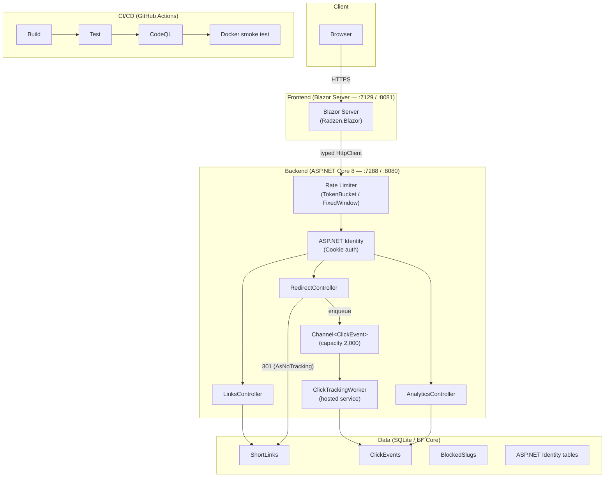

# SnipLink

**A self-hosted URL shortener built for developers who care about security, performance, and ownership.**

SnipLink turns long URLs into clean, trackable short links — with click analytics, account-scoped ownership, and sub-200 ms redirects. No third-party dependency on link availability. No ads. No tracking you didn't ask for.


## Why This Exists

Most URL shorteners are either SaaS products you don't control or open-source projects that sacrifice one of: security, performance, or developer experience.

SnipLink was built with three hard constraints:

| Constraint | Target |
|---|---|
| Redirect latency | < 200 ms (fire-and-forget click tracking — redirect never waits on analytics) |
| Security posture | HttpOnly cookies, hashed IPs, ownership-scoped queries, rate limiting, CodeQL |
| Test coverage | ≥ 80 % (unit + integration, enforced in CI) |

---

## Features

### MVP (shipped)

- [x] User registration, login, logout with ASP.NET Core Identity
- [x] HttpOnly + Secure + SameSite=Strict cookie sessions (7-day sliding)
- [x] Create, read, delete short links scoped to the authenticated user
- [x] Custom slugs with blocked-slug list to prevent reserved paths
- [x] 301 redirects with fire-and-forget click tracking via `Channel<T>`
- [x] Click analytics: total clicks, referrers, countries (IP-based, SHA-256 hashed)
- [x] Rate limiting: token bucket on create, fixed window on redirect + analytics
- [x] Email verification on registration (SMTP or Resend)
- [x] Account lockout after 5 failed login attempts (15-minute cooldown)
- [x] Docker + docker-compose for one-command deployment
- [x] GitHub Actions CI: build, test, CodeQL, Docker smoke test
- [x] Health check endpoint (`/healthz`)

---

## Architecture



---

## Tech Stack

| Layer | Technology |
|---|---|
| **Frontend** | Blazor Server (.NET 8), Radzen.Blazor |
| **Backend** | ASP.NET Core 8 Web API |
| **Database** | SQLite (dev) via EF Core 8, code-first migrations |
| **Auth** | ASP.NET Core Identity, HttpOnly cookie sessions |
| **Background work** | `System.Threading.Channels` + `IHostedService` |
| **Rate limiting** | `Microsoft.AspNetCore.RateLimiting` (built-in) |
| **Email** | SMTP (MailKit) or Resend API |
| **CI/CD** | GitHub Actions (build → test → CodeQL → Docker smoke) |
| **Security scanning** | GitHub CodeQL (C# semantic analysis) |
| **Containerisation** | Docker, docker-compose |
| **Testing** | xUnit, NSubstitute, EF Core InMemory, `WebApplicationFactory` |

---

## Getting Started

### Prerequisites

- [.NET 8 SDK](https://dotnet.microsoft.com/download/dotnet/8)
- Git

### Local development (no Docker)

```bash
# 1. Clone
git clone https://github.com/your-username/SnipLink.git
cd SnipLink

# 2. Copy the example settings file and fill in your values
cp src/SnipLink.Api/appsettings.Development.example.json \
   src/SnipLink.Api/appsettings.Local.json
# Edit appsettings.Local.json — add your SMTP credentials / Resend API key

# 3. Restore & apply migrations
dotnet restore SnipLink.sln
dotnet ef database update --project src/SnipLink.Api/SnipLink.Api.csproj

# 4. Run the API (terminal 1)
dotnet run --project src/SnipLink.Api/SnipLink.Api.csproj
# → https://localhost:7288

# 5. Run the Blazor frontend (terminal 2)
dotnet run --project src/SnipLink.Blazor/SnipLink.Blazor.csproj
# → https://localhost:7129
```

### Docker (one command)

```bash
# Copy and fill in the required env var
cp .env.example .env
# Edit .env — set ANALYTICS_IP_HASH_SALT to a long random string

docker compose up --build
# API  → http://localhost:8080
# UI   → http://localhost:8081
```

`.env.example`:

```env
ANALYTICS_IP_HASH_SALT=replace-with-a-long-random-secret
```

---

## Testing

| Type | Framework | Command |
|---|---|---|
| **Unit** | xUnit + NSubstitute + EF InMemory | `dotnet test --filter "Category=Unit"` |
| **Integration** | xUnit + `WebApplicationFactory` + EF InMemory | `dotnet test --filter "Category=Integration"` |
| **All** | — | `dotnet test src/SnipLink.Tests/SnipLink.Tests.csproj` |

Coverage is collected via `XPlat Code Coverage` on every CI run and uploaded as an artifact. Target: **≥ 80 %**.

```bash
# Run with coverage locally
dotnet test src/SnipLink.Tests/SnipLink.Tests.csproj \
  --collect:"XPlat Code Coverage" \
  --results-directory ./coverage
```

No external services are required to run the test suite — integration tests use an in-memory database.

---

## Security

### Authentication & sessions

- Passwords hashed via ASP.NET Identity (PBKDF2 + SHA-256, 100k iterations by default).
- Sessions are HttpOnly, Secure, SameSite=Strict cookies with a 7-day sliding window.
- Account lockout after 5 consecutive failed attempts (15-minute cooldown).
- Minimum password policy: 12 characters, requiring uppercase, lowercase, digit, and special character.

### Access control

- Every query against `ShortLinks` filters by `OwnerId == userId` at the EF Core level. There is no privilege-escalation path to another user's links.
- The redirect endpoint (`GET /{slug}`) is the only unauthenticated read path, and it returns only the target URL — no ownership metadata.

### Rate limiting

| Policy | Algorithm | Limit |
|---|---|---|
| `CreateLink` | Token Bucket | 20 tokens, replenish 10/min, queue 5 |
| `Redirect` | Fixed Window | 100 req/s, no queue (drop) |
| `Analytics` | Fixed Window | 60 req/min, queue 5 |

All rejections return HTTP 429.

### Privacy — IP address handling

Raw IP addresses are **never stored**. The redirect endpoint computes `SHA-256(IpAddress + salt)` and stores only the hash in `ClickEvents.IpHash`. The salt is loaded from configuration and must be set via environment variable in production.

### Input validation

- All request DTOs are validated with data annotations; invalid model state returns 400 before any business logic runs.
- Slugs are validated against an allowlist pattern and checked against a `BlockedSlugs` table to prevent path collisions (`api`, `healthz`, `swagger`, etc.).

### Static analysis & dependency scanning

- **CodeQL** runs on every push to `main` with C# semantic analysis enabled.
- Dependabot is configured to open PRs for NuGet dependency updates.

### OWASP Top 10 mapping

| OWASP Category | Mitigation in SnipLink |
|---|---|
| A01 Broken Access Control | Ownership-scoped EF queries; no admin override |
| A02 Cryptographic Failures | PBKDF2 passwords; SHA-256 IP hashing with salt; HTTPS enforced |
| A03 Injection | EF Core parameterised queries; no raw SQL |
| A04 Insecure Design | ServiceResult discriminated union prevents silent failures; rate limiting by design |
| A05 Security Misconfiguration | Secrets via env vars only; no credentials in source; CodeQL in CI |
| A06 Vulnerable Components | Dependabot NuGet updates; CodeQL dependency review |
| A07 Identification & Auth Failures | Account lockout; strong password policy; HttpOnly cookies |
| A08 Software & Data Integrity Failures | CodeQL on push; Docker image built from pinned base |
| A09 Logging & Monitoring Failures | Structured logging via `ILogger`; health check endpoint |
| A10 Server-Side Request Forgery | No outbound HTTP initiated from user-supplied URLs at redirect time |

---

## License

MIT — see [LICENSE](LICENSE).
